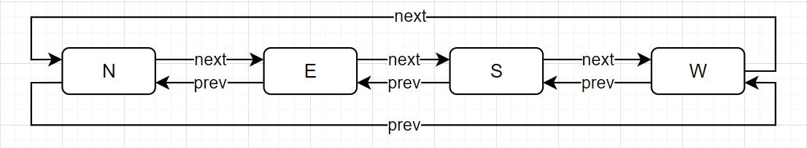

# Rover Control
This is a Rover control assignment for apply a job.  with [Next.js](https://nextjs.org/) and [Node.js Express](https://expressjs.com/).

## Problem

1. Write a code that read a file in specific format

- First line will always be a size of a maps represent in integer only.
- After that will be an instruction to move or rotate.
    - F for moving forward 1 block.
    - L for turning left.
    - R for turing right.
    - After the turning it should stay on the same block. Just direction is move.

2. Rover always start in position 0,0 with facing north.
3. A rover cannot be in negative position.
4. Rover should always report a current direction and position in format of {direction}: {position-x},{position-y}
    - N for North
    - E for East
    - W for West
    - S for South
5. If rover reaching the edge it must maintain the direction and position.

## Sample Input/Output
Input | Output
 ---- | ---- |
24|N:0,0
R|E:0,0
F|E:1,0
L|N:1,0
F|N:1,1
L|W:1,1
L|S:1,1
F|S:1,0
R|W:1,0

## Solutions

- I designed an assignment for a web application with [Next.js](https://nextjs.org/) to upload files to the [Node.js Express](https://expressjs.com/) server and return them with a rest api. A web accepts XLSX files only. On the server side, it reads excel and calculates the answer, then responds a result back.
- I an assignment to read XLSX file because I do not know what file type that an assigemnt want.
- I think this proble we can use [Doubly Circular Linked List](https://www.geeksforgeeks.org/doubly-circular-linked-list-set-1-introduction-and-insertion/) to solve about direction N, S, E, W. R is next Node and L is prev Node, But to make it simple, I did not use a doubly circular linked list.

    

## Set up project

Create project:

```bash
npx create-next-app 'project name'
npm i bootstrap express multer nodemon read-excel-file pre-commit
```

create server.js file in root for backend server

```bash
const express = require("express");
const next = require("next");

const port = 3000;
const dev = process.env.NODE_ENV !== "production";
const app = next({ dev });
const handle = app.getRequestHandler();

app.prepare().then(() => {
  const server = express();

  server.all("*", (req, res) => {
    return handle(req, res);
  });

  server.listen(port, (err) => {
    if (err) throw err;
    console.log(`> Ready on http://localhost:${port}`);
  });
});
```

change scripts in package.json only "dev" environment:

```bash
"scripts": {
    "dev": "nodemon server.js",
    "build": "next build",
    "start": "next start",
    "lint": "next lint"
  },
```

set up per-commit

```bash
 "pre-commit": [
    "lint"
  ]
```

- Uses package [read-excel-file](https://www.npmjs.com/package/read-excel-file) to read excel files.

    For browser:
    ```bash
        import readXlsxFile from 'read-excel-file'
        const input = document.getElementById('input')

        input.addEventListener('change', () => {
            readXlsxFile(input.files[0]).then((rows) => {
                // `rows` is an array of rows
                // each row being an array of cells.
            })
        })
    ```

    For Node.js:
    ```bash
        const readXlsxFile = require('read-excel-file/node')
        // File path.
        readXlsxFile('/path/to/file').then((rows) => {
            // `rows` is an array of rows
            // each row being an array of cells.
        })
    ```

## Getting Started

```bash
npm run dev
# or
yarn dev
```

Open [http://localhost:3000](http://localhost:3000) with your browser to see the result.